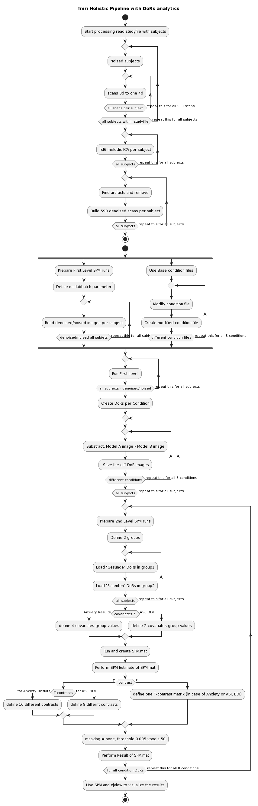

## Anwendung SOCK (Spatially Organized Component Klassifikator) (Bhaganagarapu et al., 2013)
Hier werden die Probleme und Anpassungen zur Verwendung von SOCK (Spatially Organized Component Klassifikator) genauer beschrieben und dargestellt.

Eine schriftliche Darstellung und Screenshots sind in dem Ordner "Dokumentation" zu finden.

Die Software kann hier heruntergeladen werden: https://www.nitrc.org/projects/sock/

## Genutzte Software
- Matlab R2022
- FSL 5
- FSL 6
- SPM 12
- SOCK

## Enviornment
VMWare Virtual Machine 
- CentOS 7

## Installation
Innerhalb der VM-Instanz, die auf einem Windows10-Hostsystem läuft, werden die beschriebenen Komponenten installiert.
Um die großen Datenmengen von Probanden nutzen zu können, wird eine externe USB-Festplatte genutzt.

## Literatur
Bhaganagarapu, Kaushik; Jackson, Graeme D.; Abbott, David F. (2013): An automated method for identifying artifact in independent component analysis of resting-state FMRI. In: Frontiers in human neuroscience 7, S. 343. DOI: 10.3389/fnhum.2013.00343.

## Pipelines
Die durchgeführten SW-technischen Abläufe werden hier einmal gesamtheitlich und in Sub-Workflow dargestellt.

### Sub Workflow Part 1

### Sub Workflow Part 2

### Sub Workflow Part 3

### Sub Workflow Part 4

### Sub Workflow Part 5

